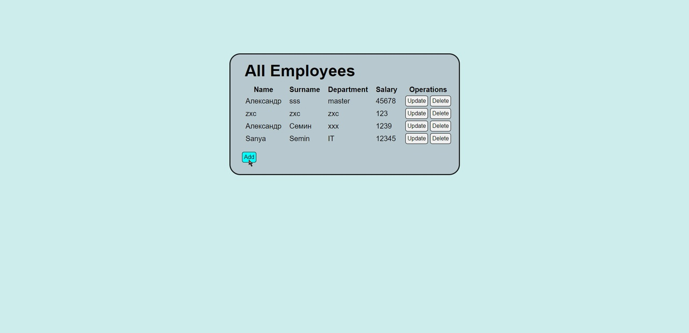
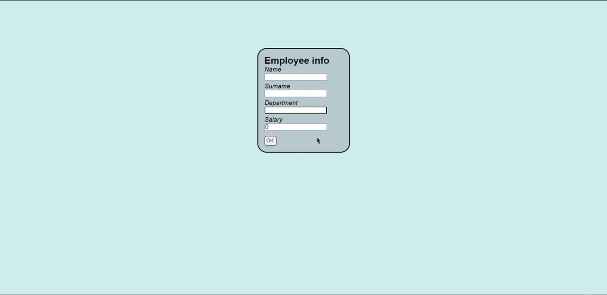

# Описание
Интерактивное веб-приложение, позволяющее работать с БД сущностей Employee.

Доступны все CRUD-операции.

Стартовая страница:

При добавлении/обновлении сущности (нажатии на кнопку add/update) появляется следующая форма для добавления данных работника:

Если происходит обновление сущности, то поля заполнены существующими данными.

Проект реализован на Spring 6.0.4.

Взаимодействие с БД осуществляется с помощью Hibernate 6.1.6.Final.

Для запуска использован Tomcat 10.